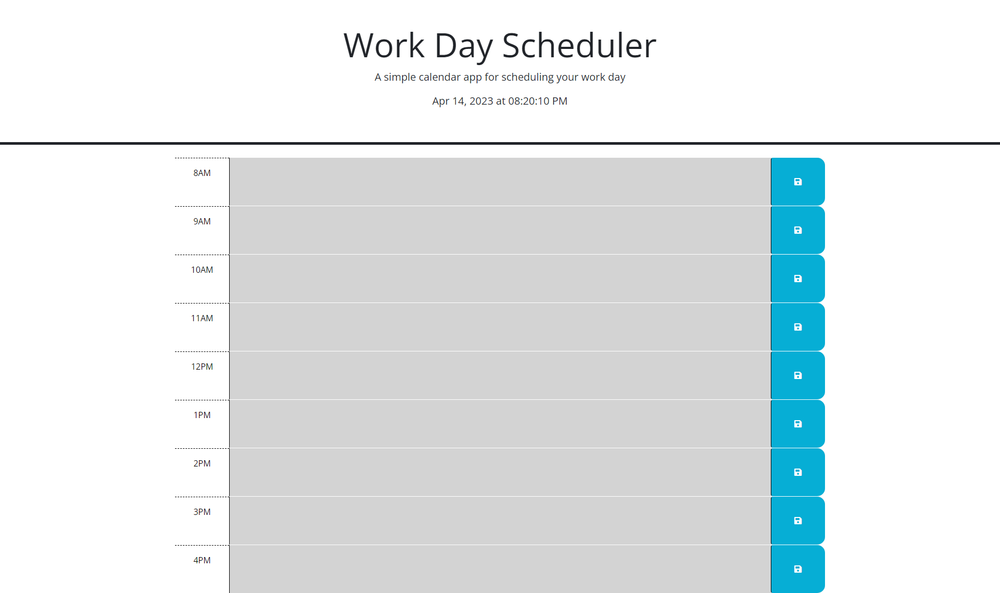
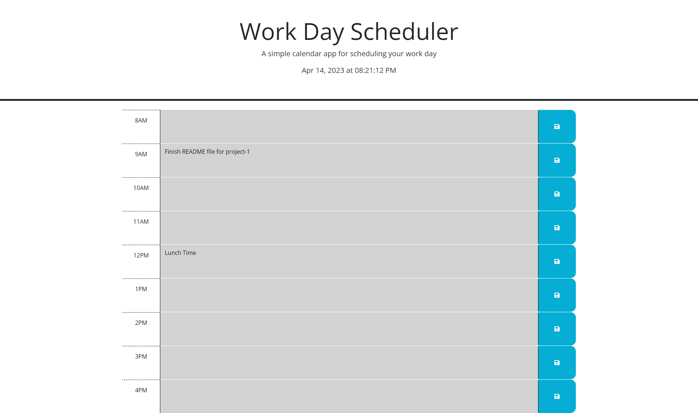
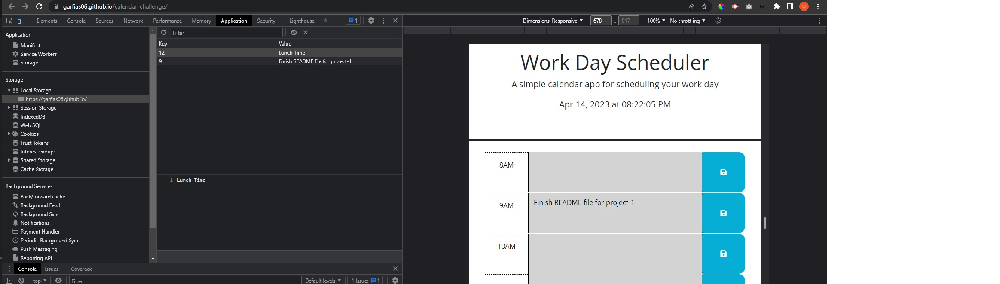
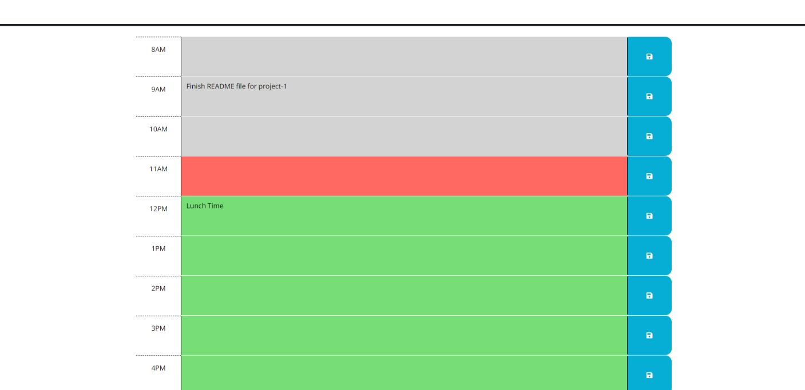

# Work-Day-Scheduler
## Description
This work-day scheduler will help the user to plan for the day writing down any pending task or important events so the user can manage time effectively and performed as wished during the work shift.

## Usage
- Work scheduler will display current day and time to the user, showing a 9 time blocks to input important events for the day.

- When adding important events, the user will be able to save all this events to the local storage by clicking on the blue button on the right side of the text area, so when the web page is refreshed all the data will remain shown to the user so the track of events is kept on screen for the user to manage time.

- Another important feature this scheduler has is that it will notify the user when a task or event is in the past, present or future so time management can be performed effectively. Past is represented as gray color, present as red color, and future as green color.

## Credits

https://jquery.com/
https://www.w3schools.com/
Tutor: Jose Lopez.

## License
MIT License

Copyright (c) [2023] [Ulises-Garfias]

Permission is hereby granted, free of charge, to any person obtaining a copy
of this software and associated documentation files (the "Software"), to deal
in the Software without restriction, including without limitation the rights
to use, copy, modify, merge, publish, distribute, sublicense, and/or sell
copies of the Software, and to permit persons to whom the Software is
furnished to do so, subject to the following conditions:

The above copyright notice and this permission notice shall be included in all
copies or substantial portions of the Software.

THE SOFTWARE IS PROVIDED "AS IS", WITHOUT WARRANTY OF ANY KIND, EXPRESS OR
IMPLIED, INCLUDING BUT NOT LIMITED TO THE WARRANTIES OF MERCHANTABILITY,
FITNESS FOR A PARTICULAR PURPOSE AND NONINFRINGEMENT. IN NO EVENT SHALL THE
AUTHORS OR COPYRIGHT HOLDERS BE LIABLE FOR ANY CLAIM, DAMAGES OR OTHER
LIABILITY, WHETHER IN AN ACTION OF CONTRACT, TORT OR OTHERWISE, ARISING FROM,
OUT OF OR IN CONNECTION WITH THE SOFTWARE OR THE USE OR OTHER DEALINGS IN THE
SOFTWARE.